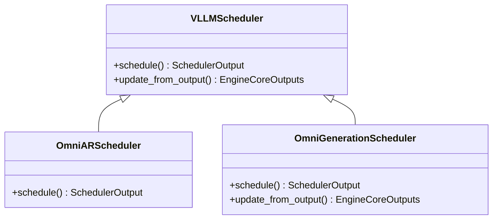
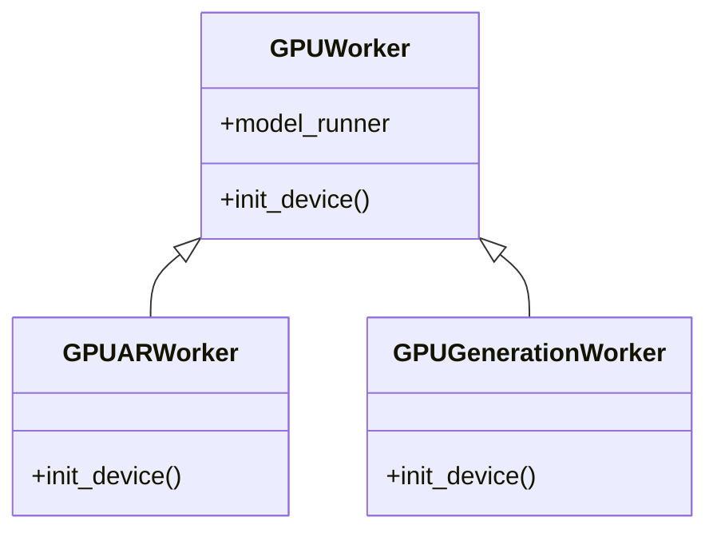
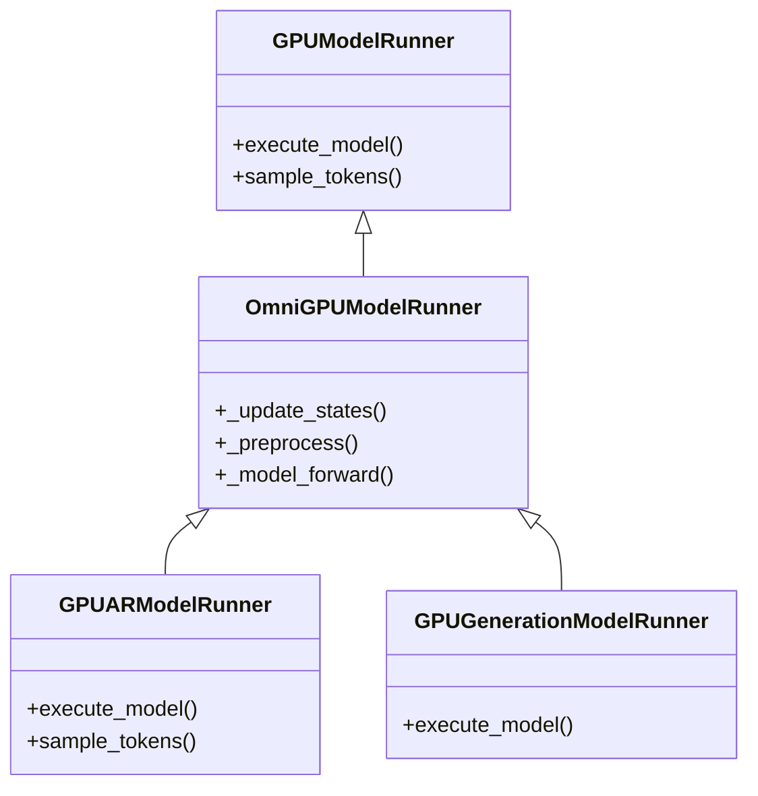
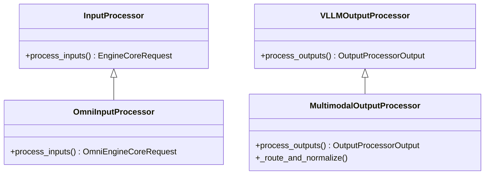
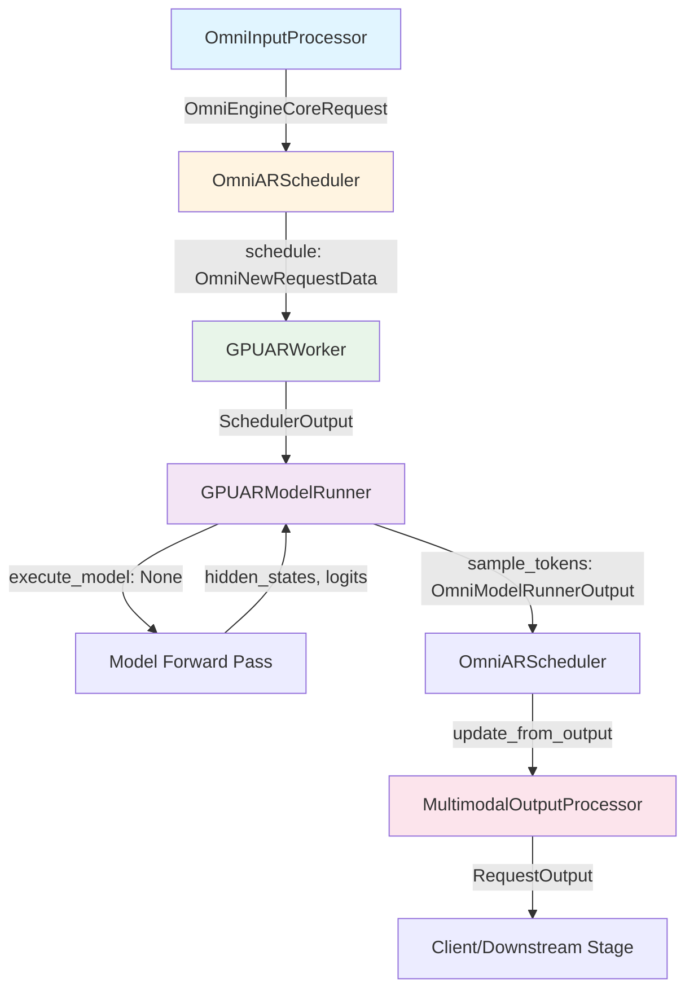
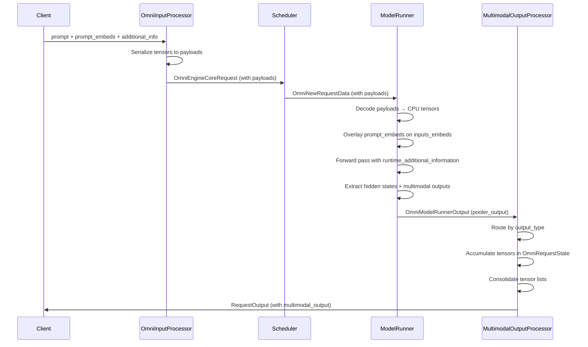

# AutoRegressive (AR) Module

## 1. Overview

The AutoRegressive (AR) module in vLLM-Omni handles autoregressive generation stages, primarily used for text, chain-of-thought(COT), and audio latent tokens generation stages in multi-stage models like Qwen2.5-Omni, Qwen3-Omni, BAGEL, .etc. Unlike some representative non-autoregressive generation stages (e.g., Diffusion), AR stages generate tokens sequentially, one at a time, following the standard transformer decoder pattern.

The AR module of vLLM-Omni extends vLLM's core components to support:

- **Multimodal inputs/outputs**: Processing images, videos, and audio alongside text
- **Direct embedding transfer**: Passing pre-computed prompt embeddings between pipeline stages via serialized payloads
- **Additional information flow**: Carrying per-request metadata (tensors, lists) through the pipeline
- **Hidden state exposure**: Exposing per-request hidden representations for downstream stages
- **Basic generator support**: Support some basic heterogeneous architecture such as Convolution, LSTM, etc.

As shown in the [end2end example](../../user_guide/examples/offline_inference/qwen3_omni.md), AR module can be widely applied across multiple stages, generating text tokens in thinker(AR), audio latent tokens in talker(AR) and audio wave in code2wav(Convolution).

## 2. Relationship with vLLM

The AR module builds upon vLLM main framework through inheritance, extending core classes while preserving compatibility with vLLM's scheduling, batching, KV cache management, and execution mechanisms.

### Inheritance Hierarchy
- Scheduler


- Worker


- ModelRunner


- InputProcessor/OutputProcessor



### Key Extensions

- **Scheduler**: `OmniARScheduler` extends `vllm.v1.core.sched.scheduler.Scheduler` to enrich scheduled requests with omni-specific payloads
- **Worker**: `GPUARWorker` extends `vllm.v1.worker.gpu_worker.Worker` to initialize AR-specific model runners
- **ModelRunner**: `GPUARModelRunner` extends `OmniGPUModelRunner` → `vllm.v1.worker.gpu_model_runner.GPUModelRunner` to expose hidden states and handle multimodal outputs
- **InputProcessor**: `OmniInputProcessor` extends `vllm.v1.engine.input_processor.InputProcessor` to serialize prompt embeddings and additional information
- **OutputProcessor**: `MultimodalOutputProcessor` extends `vllm.v1.engine.output_processor.OutputProcessor` to route and accumulate multimodal outputs

## 3. Scheduler Design

The AR module provides two scheduler implementations: one for standard autoregressive generation and one for basic heterogeneous architectures.

### Request Flow

The following diagram illustrates the request flow through the AR module components:



The flow follows vLLM's standard pattern: input processing → scheduling → worker execution → output processing, with omni-specific enrichments at each stage.

### OmniARScheduler

`OmniARScheduler` extends the base vLLM scheduler with minimal modifications, focusing on enriching scheduled requests with omni-specific payloads.

#### Modified API: `schedule()`

The scheduler wraps base `NewRequestData` entries with `OmniNewRequestData` to include prompt embeddings and additional information:

```python
def schedule(self) -> SchedulerOutput:
    scheduler_output = super().schedule()
    # Rewrap base NewRequestData entries with OmniNewRequestData
    new_list = []
    for nr in scheduler_output.scheduled_new_reqs:
        request = self.requests.get(nr.req_id)
        omni_nr = OmniNewRequestData(
            req_id=nr.req_id,
            prompt_token_ids=nr.prompt_token_ids,
            # ... other base fields ...
            prompt_embeds=getattr(request, "prompt_embeds", None),
            additional_information=getattr(request, "additional_information", None),
        )
        new_list.append(omni_nr)
    scheduler_output.scheduled_new_reqs = new_list
    return scheduler_output
```

The `update_from_output()` method remains unchanged, inheriting standard request lifecycle management from the base scheduler.

### OmniGenerationScheduler

`OmniGenerationScheduler` implements a fast-path scheduling strategy for basic heterogeneous architectures that process all input tokens in a single step.

#### Modified API: `schedule()`

Allocates all input tokens for a request at once (or 1 placeholder if zero), falling back to default scheduling if budget is insufficient:

```python
def schedule(self) -> SchedulerOutput:
    # Fast path: allocate all input tokens at once
    while self.waiting and token_budget > 0:
        request = self.waiting.peek_request()
        required_tokens = max(getattr(request, "num_prompt_tokens", 0), 1)
        if required_tokens > token_budget:
            break  # Fall back to default scheduling
        # Allocate and schedule...
```

#### Modified API: `update_from_output()`

Marks requests as finished immediately after one step, since generation models complete in a single forward pass:

```python
def update_from_output(self, ...) -> dict[int, EngineCoreOutputs]:
    # ...
    # Diffusion request: completes in one step
    request.status = RequestStatus.FINISHED_STOPPED
    kv_transfer_params = self._free_request(request)
    # ...
```

## 4. Worker and ModelRunner Design

### GPUARWorker

`GPUARWorker` initializes the AR-specific model runner while maintaining standard device initialization:

```python
class GPUARWorker(GPUWorker):
    def init_device(self):
        # ... standard device initialization ...
        self.model_runner = GPUARModelRunner(self.vllm_config, self.device)
```

### GPUARModelRunner

`GPUARModelRunner` follows vLLM's two-phase execute/sample flow while exposing hidden states and multimodal outputs.

#### Two-Phase Execution

**Phase 1: `execute_model()`** - Runs forward pass and stores state:
- Computes logits from hidden states
- Stores `ExecuteModelState` with hidden states, logits, and multimodal outputs
- Returns `None` to defer sampling

**Phase 2: `sample_tokens()`** - Samples tokens and builds output:
- Retrieves stored state from `execute_model()`
- Samples tokens using logits
- Extracts per-request hidden states and multimodal outputs
- Builds `OmniModelRunnerOutput` with `pooler_output` containing hidden states

```python
def sample_tokens(self, grammar_output) -> OmniModelRunnerOutput:
    # Retrieve stored state
    hidden_states, multimodal_outputs = self.execute_model_state

    # Sample tokens
    sampler_output = self._sample(logits, spec_decode_metadata)

    # Extract per-request hidden states
    pooler_output = []
    for rid in req_ids:
        hidden_slice = hidden_states_cpu[start:end]
        payload = {"hidden": hidden_slice}
        # Add multimodal outputs if present
        pooler_output.append(payload)

    return OmniModelRunnerOutput(
        pooler_output=pooler_output,
        # ... other fields ...
    )
```

### GPUGenerationModelRunner

`GPUGenerationModelRunner` implements a simplified single-phase execution for basic heterogeneous architectures:

- No logits computation or token sampling
- Direct generation from forward pass in model implementation
- Returns outputs via `pooler_output` immediately after forward pass

### OmniGPUModelRunner

`OmniGPUModelRunner` provides shared functionality for both AR and Generation runners:

#### Prompt Embeddings Overlay

During prefill, overlays custom `prompt_embeds` from request state onto `inputs_embeds`:

```python
def _collect_additional_information_for_prefill(self, num_scheduled_tokens_np):
    for req_index, req_id in enumerate(self.input_batch.req_ids):
        req_state = self.requests[req_id]
        pe_cpu = getattr(req_state, "prompt_embeds_cpu", None)
        # Overlay prompt_embeds for prefill portion
        if pe_cpu is not None:
            src = pe_cpu[num_computed_tokens:num_computed_tokens + overlay_len]
            self.inputs_embeds[start_offset:start_offset + overlay_len].copy_(src)
```

#### Additional Information Processing

Decodes and manages `additional_information` payloads:
- Decodes serialized payloads → CPU tensors in request state
- Passes runtime information to model via `runtime_additional_information` kwarg
- Processes model-provided updates via `postprocess()` hook
- Merges updates back into request state

#### M-RoPE Position Initialization

For multimodal models using M-RoPE (e.g., Qwen2-VL), computes position encodings from multimodal feature metadata (image grids, video grids, audio features).

## 5. Input/Output Processing

### Processing Pipeline

The input/output processing pipeline handles serialization, routing, and accumulation of multimodal data:



### OmniInputProcessor

`OmniInputProcessor` extends the base input processor to serialize prompt embeddings and additional information for inter-stage transfer.

#### Payload Serialization

Converts PyTorch tensors to serialized payloads:

```python
def process_inputs(self, ...) -> OmniEngineCoreRequest:
    # Serialize prompt_embeds
    if "prompt_embeds" in decoder_inputs:
        pe_cpu = decoder_inputs["prompt_embeds"].detach().to("cpu").contiguous()
        prompt_embeds_payload = PromptEmbedsPayload(
            data=pe_cpu.numpy().tobytes(),
            shape=[seq_len, hidden_size],
            dtype=dtype_str,
        )

    # Serialize additional_information
    if "additional_information" in decoder_inputs:
        entries = {}
        for key, value in raw_info.items():
            if isinstance(value, torch.Tensor):
                entry = AdditionalInformationEntry(
                    tensor_data=value.numpy().tobytes(),
                    tensor_shape=list(value.shape),
                    tensor_dtype=dtype_str,
                )
            entries[key] = entry
        additional_information_payload = AdditionalInformationPayload(entries=entries)

    return OmniEngineCoreRequest(
        # ... standard fields ...
        prompt_embeds=prompt_embeds_payload,
        additional_information=additional_information_payload,
    )
```

### MultimodalOutputProcessor

`MultimodalOutputProcessor` routes outputs by modality type and accumulates multimodal tensors.

#### Output Routing

Routes `EngineCoreOutput` by `output_type` attribute:
- `"text"`: Standard text generation path
- `"image"`, `"audio"`, `"latents"`: Extract from `pooling_output` or `multimodal_outputs`
- Fallback: Heuristic based on presence of `pooling_output`

#### Tensor Accumulation

`OmniRequestState` accumulates multimodal tensors across multiple steps:

```python
def add_multimodal_tensor(self, payload, mm_type):
    # Normalize payload to dict
    incoming = {mm_type or "hidden": payload}

    # Accumulate: convert tensors to lists for deferred concatenation
    if isinstance(v, torch.Tensor) and isinstance(existing, torch.Tensor):
        self.mm_accumulated[k] = [existing, v]  # List accumulation
```

Before final output, consolidates tensor lists via concatenation:

```python
def _consolidate_multimodal_tensors(self):
    for k, v in self.mm_accumulated.items():
        if isinstance(v, list) and isinstance(v[0], torch.Tensor):
            self.mm_accumulated[k] = torch.cat(v, dim=0)  # Concatenate
```

The consolidated tensors are attached to `RequestOutput.multimodal_output` for consumption by downstream stages or clients.

## 6. Summary

The AR module of vLLM-Omni extends vLLM through strategic inheritance and minimal API modifications:

### Key Design Patterns

1. **Inheritance over composition**: Extends vLLM classes to preserve compatibility with existing scheduling, batching, and execution mechanisms
2. **Payload serialization**: Uses `PromptEmbedsPayload` and `AdditionalInformationPayload` for efficient inter-stage data transfer
3. **Two-phase execution**: Maintains vLLM's execute/sample separation for AR models while supporting single-phase execution for generation models
4. **Multimodal routing**: Routes outputs by `output_type` and accumulates tensors incrementally to support streaming

### Differences from vLLM

- **Payload support**: Serialized prompt embeddings and additional information enable direct transfer between pipeline stages
- **Multimodal handling**: Extended input/output processors support images, audio, and other modalities alongside text
- **Hidden state exposure**: AR model runners expose per-request hidden states via `pooler_output` for downstream consumption
- **Generation scheduler**: Fast-path scheduling for basic heterogeneous architectures that complete in one step

The AR module seamlessly integrates with vLLM's existing infrastructure while adding the necessary extensions for multi-stage, multimodal generation pipelines.
